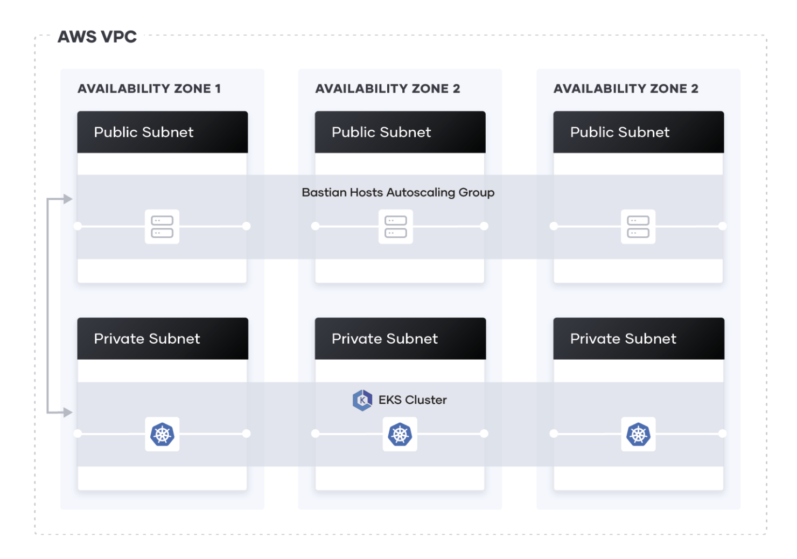

# terraform-aws-eks-airflow

The general overview of the cluster is this:



The current architecture was implemented following this guide [Provisioning an EKS Cluster guide](https://learn.hashicorp.com/terraform/kubernetes/provision-eks-cluster)

### Prerequisites

AWS account configured. For this example we are using default profile and us-east-2 region

#### Dependencies
- Cluster version: 1.15 (Specified in terraform.tfvars, version 1.16 seems not to be working when using Helm)
- Terraform >= 0.12

### Installing

To have K8s cluster running:

Execute Terraform commands:

```
terraform init --var-file=terraform.tfvars
```
```
terraform apply --var-file=terraform.tfvars
```
Once that the cluster is created, set the kubectl context:

```
aws eks --region <your-region> update-kubeconfig --name <your-cluster-name>
```

Initialize the tiller:
```
helm init
```

Configure the tiller:

```
kubectl create serviceaccount --namespace kube-system tiller
kubectl create clusterrolebinding tiller-cluster-rule --clusterrole=cluster-admin --serviceaccount=kube-system:tiller
kubectl patch deploy --namespace kube-system tiller-deploy -p '{"spec":{"template":{"spec":{"serviceAccount":"tiller"}}}}'
```

Override values.yaml (this file is used to customize the installation using Helm). In the example below, we are setting the number of worker replicas, all possible values can be seen in [values.yaml](https://github.com/helm/charts/blob/master/stable/airflow/values.yaml):

```
...
workers:
  replicas: 2
...
```

Once we have everything set in our values.yaml file, we can execute the Helm command:

```
helm install stable/airflow --name "airflow" --namespace "airflow" -f values.yaml 
```

We can verify that our pods are up and running by executing:

```
kubectl get pods -n airflow 
```

To get the airflow URL, we execute, and paste the DNS name that we will find for the external IP  under our airflow service:

```
kubectl get svc -n airflow 
```

### Removing components

To delete the Helm chart, we run:

```
helm del --purge airflow 
```

To destroy the EKS cluster, we run:

```
terraform destroy --var-file=terraform.tfvars
```


## Contributing

Please read [CONTRIBUTING.md](CONTRIBUTING.md) to know about the process for submitting pull requests to us.

## Acknowledgments

This solution was based on this guide: [Provision an EKS Cluster learn guide](https://learn.hashicorp.com/terraform/kubernetes/provision-eks-cluster), containing
Terraform configuration files to provision an EKS cluster on AWS.